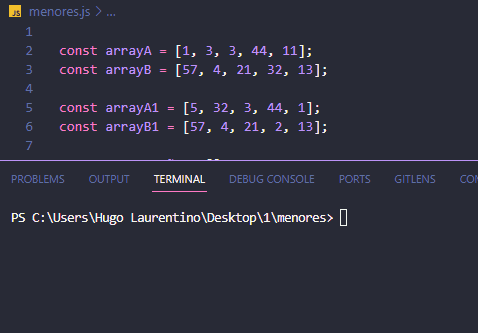

<h1 align="center">
  
</h1>

- [x] Bak-End
- [x] Criar Título
- [x] Criar Descrição
- [x] Sobre
- [x] Tecnologia
- [x] Pre requisito
- [x] Autor
- [x] GIF‘s

---
<h1 align='center'>Imprima os menores</h1>

<p align='center'>Esse é um exemplo de lógica em javascript</p>
<p align='center'>
Usando o conceito do for e while uma das formas de repetição com ternário um outro jeito de escrever o if  
</p>

<p align='center'>
 <a href='#sobre'>Sobre</a> |
 <a href='#pré-requisitos'>Pre Requisitos</a> |
 <a href='#tecnologias'>Tecnologias</a> |
 <a href='#autor'>Autor</a>
</p>

---
<h1 align='center'>
 
</h1>

const arrayA = [1, 3, 3, 44, 11];
const arrayB = [57, 4, 21, 32, 13];

const arrayA1 = [5, 32, 3, 44, 1];
const arrayB1 = [57, 4, 21, 2, 13];

---

### Sobre

  <p align= 'justify'>
  Este Programa faz uma comparação entre os dois array para saber qual e o menor entre eles e retorna imprimindo o numero em um novo array!!
</p>

---

### Pré-requisitos

Antes de começar, você vai precisar ter instalado em sua máquina as seguintes FERRAMENTAS: [GIT](https://git-scm.com/), [Node.js](https://nodejs.org/en/download).
Além disto é bom ter um editor para trabalhar com o código como [VSCode](https://code.visualstudio.com/download).

### 🎲 Rodando o Back End

```bash
# Clone este repositório
$ git clone https://github.com/hugolaurentino/menores.git

# Acesse a pasta do projeto no terminal/cmd
$ cd menores

# Instale as dependências
$ npm install

# Execute 
$ node .\menores.js

```
### Tecnologias

As seguintes ferramentas foram usadas na construção do projeto:

- [Node.js][nodejs]

---
###### tags: `lógica` `matemática` `nodeJS` `GitHub` `javascript`
## Autor
Feito com ❤️ por Hugo Laurentino 👋🏽 [Entre em contato!](https://www.linkedin.com/in/hugo-laurentino-silva/)

[nodejs]: https://nodejs.org/
